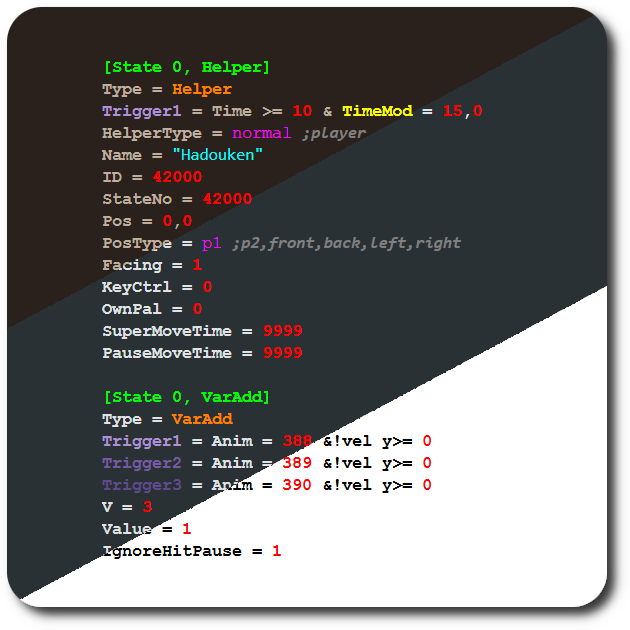

### Mugen for [Notepad++](https://notepad-plus-plus.org/)

## ✨ Highlights:
- Block controllers  
- Block parameters  
- Block headers  
- Parameter literal values  
- Strings  
- Flags  
- Constants  
- Numbers  
- Triggers  

&nbsp;

## 💾 Usage:
1. Download `mugen-udl.xml` from [Releases](../../releases).
2. Open [Notepad++](https://notepad-plus-plus.org/downloads/).
3. Go to the "Language" menu and navigate to "User Defined Language".
4. Select "Define your language..." and click "Import".
5. Import the `mugen-udl.xml` file.
6. Restart Notepad++ after seeing the "Import successful." prompt.
7. Navigate to the "Language" menu - the Mugen syntax highlighting will now be available.

&nbsp;
---