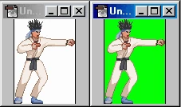

  <h2>🔧 Mugen Syntax</h2>
  
Recommendations for Mugen development

  

&nbsp;

Mugen (M.U.G.E.N) is a freeware 2D fighting game engine made by Elecbyte in 1999.
Users wanting to learn about syntax and character creation should refer to the following resources:
- [Mugen 1.1b1 Documentation](https://www.elecbyte.com/mugendocs-11b1/mugen.html#documentation)
- [State Controller (sctrls) Reference](https://www.elecbyte.com/mugendocs-11b1/sctrls.html)
- [How Do I...? A M.U.G.E.N primer](https://www.elecbyte.com/mugendocs-11b1/tutorial1.html)

&nbsp;

---
